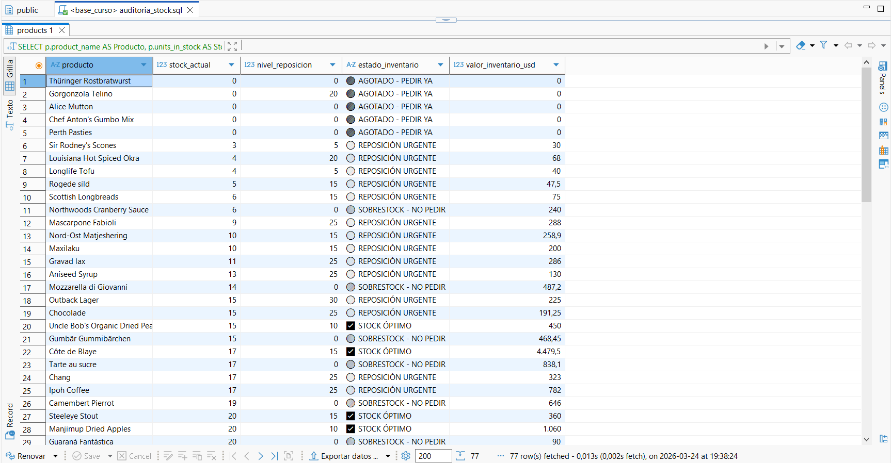

# 💡 Conclusiones Técnicas: Auditoría de Stock

Tras la ejecución del script de auditoría sobre la base de datos **Northwind**, estas son las claves técnicas y aprendizajes del proyecto:

* 🚥 **Lógica de Semáforo con `CASE WHEN`**: Implementé una estructura condicional para categorizar el inventario. Esto transforma datos numéricos planos en indicadores de gestión (KPIs) visuales, permitiendo una toma de decisiones inmediata.

* 🔢 **Precisión Financiera con Casting (`::numeric`)**: En PostgreSQL, la columna de precios suele ser `float8` o `double precision`. Para evitar errores de redondeo en cálculos de dinero, apliqué una conversión explícita a `numeric`, asegurando que el reporte financiero sea exacto.

* 📉 **Identificación de Puntos Críticos**: El uso de `units_in_stock <= reorder_level` permitió detectar productos que, aunque tienen stock físico, ya han cruzado la barrera de seguridad y requieren reposición para evitar perder ventas futuras.

* 📦 **Detección de Costo de Oportunidad**: Al identificar productos con `SOBRESTOCK`, el análisis revela dónde la empresa tiene capital inmovilizado que podría invertirse en productos de mayor rotación.

---
### 📊 Evidencia de Ejecución

> **Nota:** La imagen superior muestra el resultado real de la consulta, donde se validan las etiquetas de estado y el cálculo total por producto.
